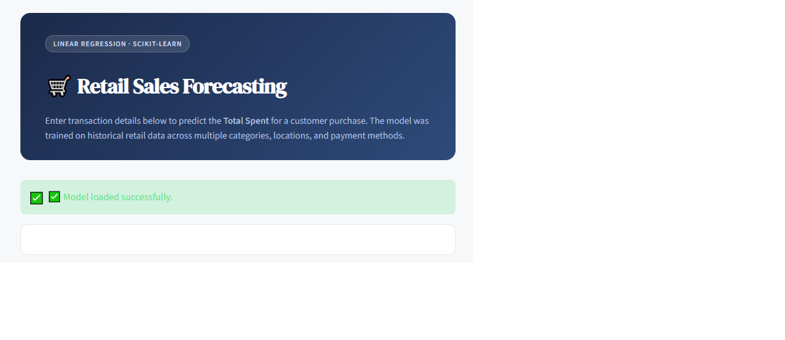
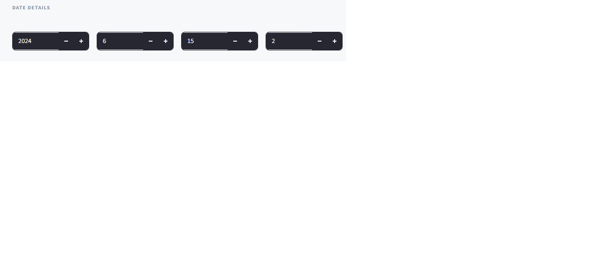
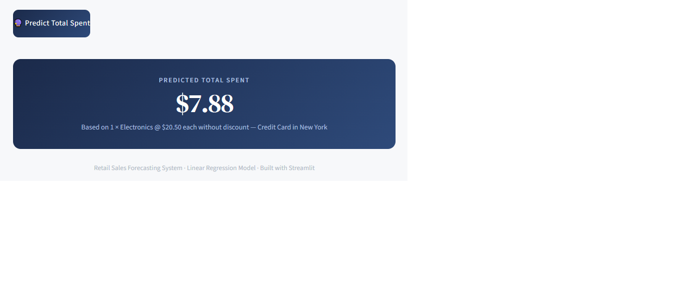

# Retail Sales Forecasting System

Machine Learning web application for predicting retail sales using Linear Regression and Streamlit.

---

## Live Demo

Access the deployed application here:

**Streamlit App:**
https://retailsalesforcecasting-sr3wxsguajfbyglxnsjxyj.streamlit.app/

---

## Model Performance

| Metric                    | Value |
| ------------------------- | ----- |
| R² Score                  | 0.89  |
| Mean Absolute Error (MAE) | 23    |
| Mean Squared Error (MSE)  | 941   |

---

## Project Overview

This project predicts the **Total Spent** in a retail transaction using customer, product, and transaction-related features.

The model was trained using **Linear Regression** from Scikit-learn and deployed through **Streamlit** to provide real-time sales predictions through an interactive web interface.

---

## Dataset

The dataset contains retail transaction records including:

* Product information
* Pricing information
* Purchase quantity
* Discount information
* Payment methods
* Store locations
* Transaction dates

### Data Preprocessing

The following preprocessing steps were performed:

* Handling missing values
* Data cleaning
* Feature selection
* Date feature extraction
* Model-ready dataset preparation

---

## Features Used

### Input Features

* Category
* Price Per Unit
* Quantity
* Payment Method
* Location
* Discount Applied
* Year
* Month
* Day
* Weekday

### Target Variable

* Total Spent

---

## Technologies Used

* Python
* Pandas
* NumPy
* Scikit-learn
* Matplotlib
* Seaborn
* Joblib
* Streamlit

---

## Machine Learning Model

### Linear Regression

The final model was trained using Scikit-learn's Linear Regression algorithm.

Several regression approaches were explored and compared before selecting the final model.

### Evaluation Metrics

* R² Score
* Mean Absolute Error (MAE)
* Mean Squared Error (MSE)

---

## Application Screenshots

### Home Page



### Prediction Form




### Prediction Result




---

## Project Structure

```text
retail-sales-forecasting/
│
├── app.py
├── train.py
├── requirements.txt
├── README.md
│── retail_store_sales_cleaned.csv
├── data/
│   ├── retail_store_sales.csv
│   └── retail_store_sales_cleaned.csv
│
├── sales_model.pkl
│── model_columns.pkl
│
├── notebooks/
│   ├── retail_sales_forecasting_analysis.ipynb
│   └── train.ipynb
│
└── assets/
    ├── home_page.png
    ├── form1.png
    ├── form2.png
    └── prediction_result.png
```

---

## Installation

Clone the repository:

```bash
git clone https://github.com/AbdullahMahmoud05/Retail_Sales_ForceCasting
cd retail-sales-forecasting
```

Install dependencies:

```bash
pip install -r requirements.txt
```

---

## Run Locally

Start the Streamlit application:

```bash
streamlit run app.py
```

---

## Future Improvements

* Hyperparameter tuning
* Additional regression models
* Advanced feature engineering
* Improved UI/UX
* Model monitoring and maintenance

---

## Contributors

* Abdullah Mahmoud Fathy
* Ahmed Abdelmonem Abdelfattah
* Rawan Nour Nour Eldien

---

## Acknowledgements

This project was developed as part of a Machine Learning learning journey and academic practice project.

---

## License

This project is intended for educational and learning purposes.
